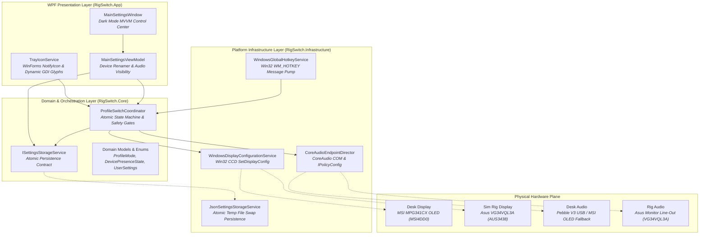
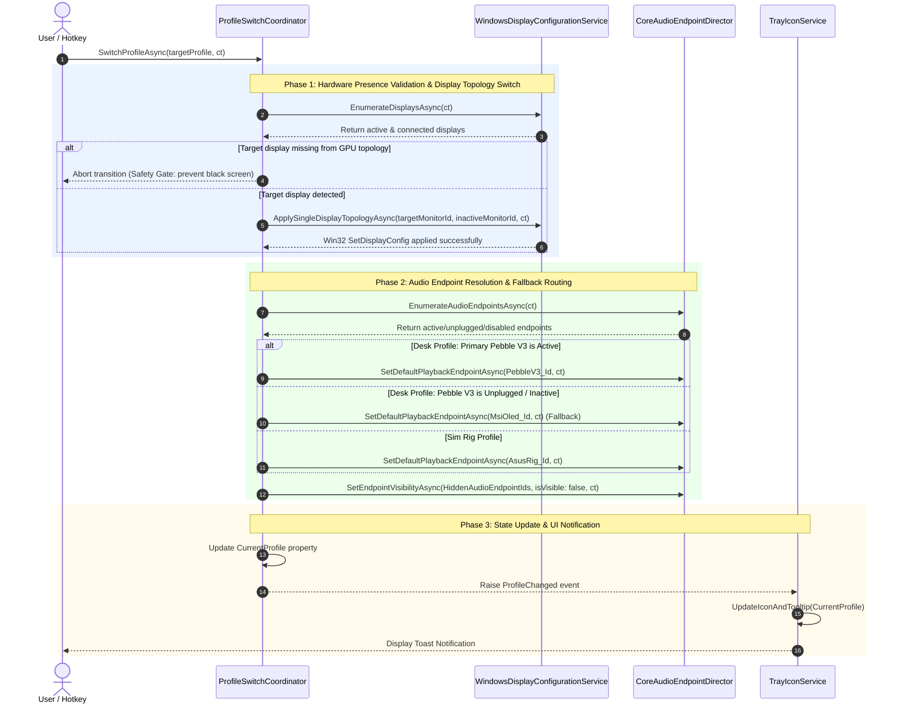

# 🏛️ RigSwitch Architecture & Technical Reference

> **Standard**: Conforms strictly to Steven T. Pelech's `AgenticEngineeringToolbelt`  
> **Runtime**: .NET 10.0 (Windows Desktop `net10.0-windows`, C# 13)  
> **Solution Format**: XML-based `.slnx`

---

## 1. Executive Summary & Purpose

**RigSwitch** is an ultra-low-latency Windows desktop control plane and system tray utility designed to execute atomic hardware transitions between two specialized workstation profiles:

1. **Desk Setup**: Primary MSI MPG341CX OLED display active; Sim Rig display disabled in Windows topology; default playback routed to Desk Creative Pebble V3 USB audio with automatic fallback to MSI monitor audio when Pebble V3 is unplugged or switched to AUX.
2. **Sim Rig Setup**: Primary Asus VG34VQL3A ultrawide display active; Desk OLED display disabled in Windows topology; default playback routed to Asus high-definition display audio (feeding Pebble V2 via 3.5mm line-out).

By directly leveraging Win32 Connecting and Configuring Displays (CCD) APIs and CoreAudio COM interfaces, RigSwitch eliminates the need for physical monitor power cycling, prevents phantom displays, and ensures games launch reliably on the intended screen.

---

## 2. Core Architectural Tenets (`AgenticEngineeringToolbelt`)

RigSwitch is constructed under the rigorous discipline of Steven T. Pelech's `AgenticEngineeringToolbelt`:

* **Zero Junk Drawers (Anti-Bloat Policy)**: Strict ban on amorphous `*Manager`, `*Helper`, or `*Util` catch-all classes. Every component has a single, well-bounded domain responsibility (e.g., `ProfileSwitchCoordinator`, `TrayIconService`, `JsonSettingsStorageService`).
* **Strict File Size Ceiling**: Every file across all source and test projects is strictly capped at `< 500` lines of code (with actual max file length $\le 368$ lines).
* **Fail-Safe Safety Gates**: Before disabling an active display, the coordinator validates that the target display is physically connected and detected by the GPU driver. If missing, the transition safely aborts without leaving the user on a black screen.
* **Atomic State Persistence**: Configuration state in `%APPDATA%\RigSwitch\settings.json` is written via write-to-temp and atomic rename (`File.Move(temp, target, overwrite: true)`) to prevent corrupted or partial file writes.
* **Decoupled Interfaces by Default**: All core and platform services expose explicit `I*` contracts (`IDisplayConfigurationService`, `IAudioEndpointDirector`, `IGlobalHotkeyService`, `IProfileSwitchCoordinator`, `ISettingsStorageService`), enabling test isolation.
* **Controls-Grade Simulation & Observability**: High-volume stress testing and disturbance injection verify convergence under simulated hardware drops, backed by a fixed-capacity circular `DiagnosticRingBuffer` and standardized 6-part agent feedback envelopes.

---

## 3. Top-Down System Topology



---

## 4. Hardware Device Catalog & State Mapping

RigSwitch maps hardware devices detected via Win32 CCD and PnP queries:

### Workstation Profile Hardware Mapping

| Profile | Active Display (Enabled) | Inactive Display (Disabled) | Primary Audio Endpoint | Fallback Audio Endpoint |
| :--- | :--- | :--- | :--- | :--- |
| **Desk Setup** | `MONITOR\MSI4DD0`<br/>(MSI MPG341CX OLED) | `MONITOR\AUS3438`<br/>(Asus VG34VQL3A) | `Speakers (Pebble V3)`<br/>`{D2B56B79-F353-4FB0-81B6-ECEF8E95E57A}` | `MPG341CX OLED (NVIDIA Audio)`<br/>`{EE0329B0-FA5C-4731-B0F1-8E188AB441DC}` |
| **Sim Rig Setup** | `MONITOR\AUS3438`<br/>(Asus VG34VQL3A) | `MONITOR\MSI4DD0`<br/>(MSI MPG341CX OLED) | `VG34VQL3A (NVIDIA Audio)`<br/>`{3CF792EA-E074-4D66-A8A1-9C4F1A8B204F}` | *None (Direct pass-through to Pebble V2 via 3.5mm)* |

### Managed / Unwanted Virtual Endpoints (Default Hidden)

RigSwitch allows users to hide cluttering virtual endpoints created by third-party audio drivers:

| Friendly Device Name | Windows MMDevice Endpoint ID | Default State |
| :--- | :--- | :--- |
| `SteelSeries Sonar - Gaming` | `{4C84EB15-46E9-47BE-BC9B-BB93C43FFCA8}` | Hidden |
| `SteelSeries Sonar - Chat` | `{E32080F3-4D16-48D8-934B-13ED01E7D0E6}` | Hidden |
| `SteelSeries Sonar - Media` | `{5EB8AEAD-C887-4D10-8816-CCB6878A3F40}` | Hidden |
| `SteelSeries Sonar - Aux` | `{E4620821-5066-4BE1-A337-5A303AA1950A}` | Hidden |
| `SteelSeries Sonar - Microphone` | `{B95DCEBE-55B7-4BB6-BF9F-EEEA0C634D12}` | Hidden |
| `Headphones (Oculus Virtual Audio Device)` | `{AF3E716C-A16E-49C0-80DD-9E474E054079}` | Hidden |
| `Speakers (Steam Streaming Speakers)` | `{21F218E9-3A8C-4783-B529-D45EABD58BAB}` | Hidden |

---

## 5. Profile Transition Sequence & Multi-Tier Fallback



---

## 6. Solution & Project Directory Structure

```
RigSwitch/
├── Directory.Build.props              # Global compiler properties (<Nullable>, <TreatWarningsAsErrors>)
├── RigSwitch.slnx                     # Modern XML solution file linking all 5 projects
├── ARCHITECTURE.md                    # Living architectural documentation & design specification
├── README.md                          # Project quickstart, hardware mapping & usage guide
├── .github/
│   └── workflows/
│       └── ci.yml                     # 4-stage GitHub Actions verification pipeline
├── src/
│   ├── RigSwitch.Core/                # Domain core and contracts (net10.0-windows)
│   │   ├── Enums/                     # ProfileMode, DevicePresenceState
│   │   ├── Interfaces/                # IDisplayConfigurationService, IAudioEndpointDirector,
│   │   │                              # IGlobalHotkeyService, IProfileSwitchCoordinator, ISettingsStorageService
│   │   ├── Models/                    # DisplayDeviceInfo, AudioEndpointInfo, UserSettings, ProfileChangedEventArgs
│   │   └── Services/                  # ProfileSwitchCoordinator
│   ├── RigSwitch.Infrastructure/      # Hardware and OS platform integration (net10.0-windows)
│   │   ├── Windows/Ccd/               # NativeCcdApi, INativeCcdApi, WindowsNativeCcdApi, WindowsDisplayConfigurationService
│   │   ├── Windows/CoreAudio/         # ComInterfaces, INativeAudioProvider, WindowsNativeAudioProvider, CoreAudioEndpointDirector
│   │   ├── Windows/Hotkeys/           # NativeHotkeyApi, INativeHotkeyProvider, WindowsNativeHotkeyProvider, WindowsGlobalHotkeyService
│   │   └── Storage/                   # JsonSettingsStorageService
│   └── RigSwitch.App/                 # Desktop presentation and entry point (net10.0-windows, WPF)
│       ├── App.xaml / App.xaml.cs     # HostApplicationBuilder DI initialization & tray lifecycle
│       ├── Services/                  # TrayIconService (NotifyIcon & GDI icon rendering)
│       ├── ViewModels/                # ViewModelBase, RelayCommand, MainSettingsViewModel,
│       │                              # AudioEndpointVisibilityItemViewModel, DeviceNicknameItemViewModel
│       └── Views/                     # MainSettingsWindow.xaml, MainSettingsWindow.xaml.cs
└── tests/
    ├── RigSwitch.Tests.Unit/          # 88 comprehensive unit tests across domain, CCD, CoreAudio, and MVVM
    └── RigSwitch.Tests.Harness/       # 9 controls-grade stress tests with disturbance injection & ring buffer
```

---

## 7. Controls-Grade Testing & Diagnostic Envelope

The solution incorporates a controls-grade simulation harness (`RigSwitch.Tests.Harness`):

* **Diagnostic Ring Buffer (`DiagnosticRingBuffer.cs`)**: Fixed-size, thread-safe circular array (capacity 100) logging transitions, thread IDs, timestamps, and step outcomes. Snapshots unroll in chronological order for deterministic post-mortem debugging.
* **Disturbance Injection**:
  * `MonitorUnpluggedDisturbance`: Simulates abrupt physical monitor disconnection, verifying that the coordinator safety gate halts execution before disabling the remaining screen.
  * `AudioFallbackDisturbance`: Toggles Pebble V3 presence during rapid profile switching to confirm seamless failover to MSI OLED audio.
* **6-Part Agent Feedback Envelope**: Any simulation disturbance or gate violation generates a structured diagnostic payload:
  ```json
  {
    "inputs": { "target_profile": "SimRig", "cancellation_requested": false },
    "active_settings": { "desk_monitor": "MSI4DD0", "rig_monitor": "AUS3438" },
    "action_history": [
      { "step": 1, "action": "EnumerateDisplays", "result": "Success" },
      { "step": 2, "action": "VerifyTargetDisplayPresent", "result": "Failed: Target display not detected" }
    ],
    "output_delta": { "expected_state": "SimRig", "actual_state": "Desk" },
    "captured_logs": [ "[SAFETY GATE] Target monitor AUS3438 not detected. Aborting profile switch to prevent black screen." ],
    "reproduction_command": "dotnet test tests/RigSwitch.Tests.Harness --filter FullyQualifiedName~SimulationStressTests"
  }
  ```
