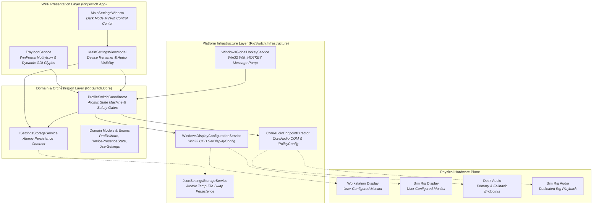

# 🏛️ RigSwitch Architecture & Technical Reference

> **Standard**: Conforms strictly to Steven T. Pelech's `AgenticEngineeringToolbelt`  
> **Runtime**: .NET 10.0 (Windows Desktop `net10.0-windows`, C# 13)  
> **Solution Format**: XML-based `.slnx`

---

## 1. Executive Summary & Purpose

**RigSwitch** is an ultra-low-latency Windows desktop control plane and system tray utility designed to execute atomic hardware transitions between two user-configured workstation profiles:

1. **Desk Setup**: Primary workstation display active; secondary/simulator display disabled in Windows topology; default playback routed to primary desk audio with automatic fallback to secondary audio when unplugged or offline.
2. **Sim Rig Setup**: Simulator or secondary display active; workstation display disabled in Windows topology; default playback routed to dedicated rig audio.

By directly leveraging Win32 Connecting and Configuring Displays (CCD) APIs and CoreAudio COM interfaces, RigSwitch eliminates the need for physical monitor power cycling, prevents phantom displays, and ensures games launch reliably on the intended screen.

---

## 2. Core Architectural Tenets (`AgenticEngineeringToolbelt`)

RigSwitch is constructed under the rigorous discipline of Steven T. Pelech's `AgenticEngineeringToolbelt`:

* **Zero Junk Drawers (Anti-Bloat Policy)**: Strict ban on amorphous `*Manager`, `*Helper`, or `*Util` catch-all classes. Every component has a single, well-bounded domain responsibility (e.g., `ProfileSwitchCoordinator`, `TrayIconService`, `JsonSettingsStorageService`).
* **Strict File Size Ceiling**: Every file across all source and test projects is strictly capped at `< 500` lines of code.
* **Fail-Safe Safety Gates**: Before disabling an active display, the coordinator validates that the target display is physically connected and detected by the GPU driver. If missing, the transition safely aborts without leaving the user on a black screen.
* **Atomic State Persistence**: Configuration state in `%APPDATA%\RigSwitch\settings.json` is written via write-to-temp and atomic rename (`File.Move(temp, target, overwrite: true)`) to prevent corrupted or partial file writes.
* **Decoupled Interfaces by Default**: All core and platform services expose explicit `I*` contracts (`IDisplayConfigurationService`, `IAudioEndpointDirector`, `IGlobalHotkeyService`, `IProfileSwitchCoordinator`, `ISettingsStorageService`), enabling test isolation.
* **Controls-Grade Simulation & Observability**: High-volume stress testing and disturbance injection verify convergence under simulated hardware drops, backed by a fixed-capacity circular `DiagnosticRingBuffer` and standardized 6-part agent feedback envelopes.

---

## 3. Top-Down System Topology



---

## 4. Hardware Profile Configuration & Device Mapping

Hardware device assignments are fully configurable and detected automatically by RigSwitch:

### Profile Role Mapping

| Profile | Active Display (Enabled) | Inactive Display (Disabled) | Primary Audio Endpoint | Fallback Audio Endpoint |
| :--- | :--- | :--- | :--- | :--- |
| **Desk Setup** | Configured Workstation Monitor | Configured Sim Rig Monitor | Primary Desk Playback Device | Fallback Audio Device |
| **Sim Rig Setup** | Configured Sim Rig Monitor | Configured Workstation Monitor | Primary Rig Playback Device | *(Optional)* |

### Endpoint Visibility Control

Users can hide cluttering or unused virtual audio devices (such as virtual channels, VR audio devices, or streaming drivers) directly from the Audio Visibility settings tab.

---

## 5. Profile Transition Sequence & Multi-Tier Fallback


---

## 6. Solution & Project Directory Structure

```
RigSwitch/
├── Directory.Build.props              # Global compiler properties (<Nullable>, <TreatWarningsAsErrors>)
├── RigSwitch.slnx                     # Modern XML solution file linking all 5 projects
├── ARCHITECTURE.md                    # Living architectural documentation & design specification
├── README.md                          # Project quickstart, configuration & usage guide
├── .github/
│   └── workflows/
│       └── ci.yml                     # 4-stage GitHub Actions verification pipeline
├── src/
│   ├── RigSwitch.Core/                # Domain core and contracts (net10.0-windows)
│   │   ├── Enums/                     # ProfileMode, DevicePresenceState
│   │   ├── Interfaces/                # IDisplayConfigurationService, IAudioEndpointDirector,
│   │   │                              # IGlobalHotkeyService, IProfileSwitchCoordinator, ISettingsStorageService
│   │   ├── Models/                    # DisplayDeviceInfo, AudioEndpointInfo, UserSettings, ProfileChangedEventArgs
│   │   └── Services/                  # ProfileSwitchCoordinator
│   ├── RigSwitch.Infrastructure/      # Hardware and OS platform integration (net10.0-windows)
│   │   ├── Windows/Ccd/               # NativeCcdApi, INativeCcdProvider, WindowsNativeCcdProvider, WindowsDisplayConfigurationService
│   │   ├── Windows/CoreAudio/         # ComInterfaces, INativeAudioProvider, WindowsNativeAudioProvider, CoreAudioEndpointDirector
│   │   ├── Windows/Hotkeys/           # NativeHotkeyApi, INativeHotkeyProvider, WindowsNativeHotkeyProvider, WindowsGlobalHotkeyService
│   │   └── Storage/                   # JsonSettingsStorageService
│   └── RigSwitch.App/                 # Desktop presentation and entry point (net10.0-windows, WPF)
│       ├── App.xaml / App.xaml.cs     # HostApplicationBuilder DI initialization & tray lifecycle
│       ├── Services/                  # TrayIconService (NotifyIcon & GDI icon rendering)
│       ├── ViewModels/                # ViewModelBase, RelayCommand, MainSettingsViewModel, DeviceSelectionOption,
│       │                              # AudioEndpointVisibilityItemViewModel, DeviceNicknameItemViewModel
│       └── Views/                     # MainSettingsWindow.xaml, MainSettingsWindow.xaml.cs
└── tests/
    ├── RigSwitch.Tests.Unit/          # 95 comprehensive unit tests across domain, CCD, CoreAudio, and MVVM
    └── RigSwitch.Tests.Harness/       # 9 controls-grade stress tests with disturbance injection & ring buffer
```

---

## 7. Controls-Grade Testing & Diagnostic Envelope

The solution incorporates a controls-grade simulation harness (`RigSwitch.Tests.Harness`):

* **Diagnostic Ring Buffer (`DiagnosticRingBuffer.cs`)**: Fixed-size, thread-safe circular array (capacity 100) logging transitions, thread IDs, timestamps, and step outcomes. Snapshots unroll in chronological order for deterministic post-mortem debugging.
* **Disturbance Injection**:
  * `MonitorUnpluggedDisturbance`: Simulates abrupt physical monitor disconnection, verifying that the coordinator safety gate halts execution before disabling the remaining screen.
  * `AudioFallbackDisturbance`: Toggles primary audio endpoint presence during rapid profile switching to confirm seamless failover to fallback audio.
* **6-Part Agent Feedback Envelope**: Any simulation disturbance or gate violation generates a structured diagnostic payload:
  ```json
  {
    "inputs": { "target_profile": "SimRig", "cancellation_requested": false },
    "active_settings": { "desk_monitor": "DESK_MONITOR_1", "rig_monitor": "RIG_MONITOR_1" },
    "action_history": [
      { "step": 1, "action": "EnumerateDisplays", "result": "Success" },
      { "step": 2, "action": "VerifyTargetDisplayPresent", "result": "Failed: Target display not detected" }
    ],
    "output_delta": { "expected_state": "SimRig", "actual_state": "Desk" },
    "captured_logs": [ "[SAFETY GATE] Target monitor not detected. Aborting profile switch to prevent black screen." ],
    "reproduction_command": "dotnet test tests/RigSwitch.Tests.Harness --filter FullyQualifiedName~SimulationStressTests"
  }
  ```
