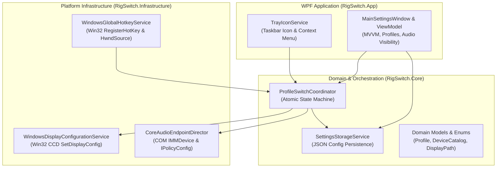
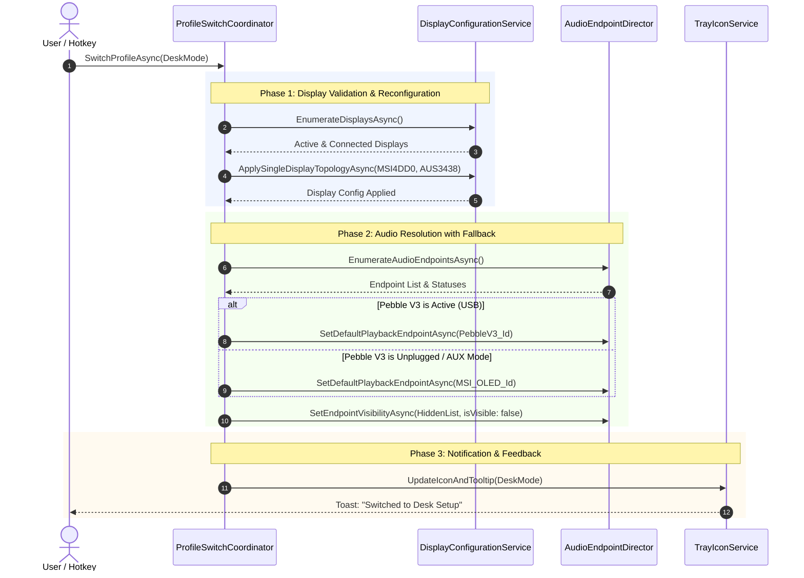

# 🚀 RigSwitch: System Architecture & Design Specification

> **Status**: Approved  
> **Date**: 2026-09-19  
> **Author**: Steven T. Pelech & Antigravity  
> **Target Runtime**: C# / .NET 10 (Windows x64)  
> **Archetype**: Native C# Desktop UI & Control Plane (`AgenticEngineeringToolbelt`)  

---

## 📌 1. Executive Summary & Objectives

**RigSwitch** is a native Windows system tray utility and hardware control plane designed to seamlessly switch between two distinct workstation setups:
1. **Desk Setup**: Main MSI MPG341CX OLED display active, Asus sim rig display disabled; audio routed to Desk Creative Pebble V3 (with automatic fallback to MSI monitor audio when Pebble V3 is in AUX mode or disconnected).
2. **Sim Rig Setup**: Asus VG34VQL3A ultrawide display active, MSI desk display disabled; audio routed to Asus monitor high-definition audio (outputting to Pebble V2 via the monitor's 3.5mm jack).

### Key Constraints & Requirements
- **No Physical Power Toggling**: Eliminate the need to manually reach behind or turn off monitors to force primary display reallocation.
- **Display Disabling (Not Just Primary Swap)**: The inactive display is disabled in Windows to prevent cursor displacement and avoid games launching off-screen.
- **Fail-Safe Safety Gate**: Before disabling the desk display, verify the target rig display is physically connected and recognized by the GPU.
- **Audio Routing & Fallback**: Automatically route default multimedia and communication audio; support multi-tier fallback (Pebble V3 $\rightarrow$ MSI OLED).
- **Audio Endpoint Visibility Control**: Provide an interface and service to disable/hide cluttering virtual audio devices (e.g. SteelSeries Sonar virtual endpoints, Oculus, Steam Streaming) directly in Windows.
- **Global Hotkey & System Tray**: Runs silently in the system tray with single-click toggle, right-click context menu, and global hotkeys (`Ctrl+Alt+S` toggle, `Ctrl+Alt+D` desk, `Ctrl+Alt+R` rig) that function even inside exclusive full-screen simulators.
- **Toolbelt Discipline**: Strictly adhere to Steven T. Pelech's **`AgenticEngineeringToolbelt`**:
  - No `*Manager`, `*Helper`, or `*Util` junk drawers.
  - Client-focused interfaces (`I*`) for all components.
  - Maximum 500 lines of code per file/class.
  - Controls-grade simulation test harness with a 6-part agent feedback envelope.

---

## 🖥️ 2. Hardware Topology & Profile Mapping

Based on live PnP and Win32 CCD bus queries:

| Profile | Target Display (Active) | Disabled Display | Primary Audio Output | Fallback Audio Output |
| :--- | :--- | :--- | :--- | :--- |
| **Desk Setup** | `MONITOR\MSI4DD0` (MSI MPG341CX OLED) | `MONITOR\AUS3438` (Asus VG34VQL3A) | `Speakers (Pebble V3)` (`{D2B56B79-F353-4FB0-81B6-ECEF8E95E57A}`) | `MPG341CX OLED (NVIDIA High Definition Audio)` (`{EE0329B0-FA5C-4731-B0F1-8E188AB441DC}`) |
| **Sim Rig Setup** | `MONITOR\AUS3438` (Asus VG34VQL3A) | `MONITOR\MSI4DD0` (MSI MPG341CX OLED) | `VG34VQL3A (NVIDIA High Definition Audio)` (`{3CF792EA-E074-4D66-A8A1-9C4F1A8B204F}`) $\rightarrow$ Pebble V2 3.5mm | None |

### Managed / Unwanted Virtual Endpoints (Default Hidden)
- `SteelSeries Sonar - Gaming` (`{4C84EB15-46E9-47BE-BC9B-BB93C43FFCA8}`)
- `SteelSeries Sonar - Chat` (`{E32080F3-4D16-48D8-934B-13ED01E7D0E6}`)
- `SteelSeries Sonar - Media` (`{5EB8AEAD-C887-4D10-8816-CCB6878A3F40}`)
- `SteelSeries Sonar - Aux` (`{E4620821-5066-4BE1-A337-5A303AA1950A}`)
- `SteelSeries Sonar - Microphone` (`{B95DCEBE-55B7-4BB6-BF9F-EEEA0C634D12}`)
- `Headphones (Oculus Virtual Audio Device)` (`{AF3E716C-A16E-49C0-80DD-9E474E054079}`)
- `Speakers (Steam Streaming Speakers)` (`{21F218E9-3A8C-4783-B529-D45EABD58BAB}`)

---

## 🏛️ 3. Architecture & Component Decomposition



### Core Interfaces & Responsibilities

1. **`IDisplayConfigurationService`**:
   - `Task<IReadOnlyList<DisplayDeviceInfo>> EnumerateDisplaysAsync(CancellationToken ct);`
   - `Task ApplySingleDisplayTopologyAsync(string targetMonitorId, string? inactiveMonitorId, CancellationToken ct);`
   - Interacts with `user32.dll` (`QueryDisplayConfig`, `SetDisplayConfig`).
2. **`IAudioEndpointDirector`**:
   - `Task<IReadOnlyList<AudioEndpointInfo>> EnumerateAudioEndpointsAsync(CancellationToken ct);`
   - `Task SetDefaultPlaybackEndpointAsync(string endpointId, CancellationToken ct);`
   - `Task SetEndpointVisibilityAsync(string endpointId, bool isVisible, CancellationToken ct);`
   - Interacts with Windows CoreAudio COM interfaces (`IMMDeviceEnumerator`, `IPolicyConfig`).
3. **`IGlobalHotkeyService`**:
   - `void RegisterHotkey(string id, ModifierKeys modifiers, Key key, Action callback);`
   - `void UnregisterAllHotkeys();`
   - Binds to Win32 message-only window handle (`WM_HOTKEY`).
4. **`IProfileSwitchCoordinator`**:
   - `Task SwitchProfileAsync(ProfileMode targetProfile, CancellationToken ct);`
   - `ProfileMode CurrentProfile { get; }`
   - Event: `event EventHandler<ProfileChangedEventArgs>? ProfileChanged;`
   - Implements atomic switching, fail-safe verification, fallback audio resolution, and progress events.
5. **`ISettingsStorageService`**:
   - `Task<UserSettings> LoadSettingsAsync(CancellationToken ct);`
   - `Task SaveSettingsAsync(UserSettings settings, CancellationToken ct);`
   - Atomic file write to `%APPDATA%\RigSwitch\settings.json`.

---

## 🔄 4. Switching Execution Sequence & Fallback Logic



---

## 🧪 5. Testing & Controls-Grade Simulation Harness

In accordance with **`test-harness-builder`** and **`TESTING_HARNESS_PATTERNS.md`**:

### Unit Test Suite (`RigSwitch.Tests.Unit`)
- **`ProfileSwitchCoordinatorTests`**: Verifies strict execution ordering, state transitions, and `CancellationToken` cancellation semantics using NSubstitute mocks.
- **`AudioEndpointDirectorTests`**: Asserts fallback logic (Pebble V3 $\rightarrow$ MSI OLED) when primary audio is unplugged.
- **`SettingsStorageServiceTests`**: Asserts atomic write patterns, corrupt JSON recovery, and default config seeding.

### Simulation Harness (`RigSwitch.Tests.Harness`)
- **`HighVolumeSwitchingLoop`**: Executes 50 rapid back-and-forth profile flips under concurrent task execution to detect race conditions, state drift, and resource leakage.
- **`DisturbanceInjection`**:
  - `TargetMonitorMissing`: Simulates switching to Rig when the Asus monitor is physically unplugged; verifies that the switch aborts safely without disabling the primary display.
  - `AudioFallbackPerturbation`: Toggles simulated Pebble V3 connection state randomly during switch transitions to ensure zero unhandled exceptions and correct fallback routing.
  - `ProcessAbortCancellation`: Triggers abrupt `CancellationTokenSource.Cancel()` mid-transition and confirms clean state rollback.
- **6-Part Agent Feedback Envelope**: Any harness test failure outputs a standardized JSON payload:
  ```json
  {
    "inputs": { "target_profile": "SimRig", "cancellation_requested": false },
    "active_settings": { "desk_monitor": "MSI4DD0", "rig_monitor": "AUS3438" },
    "action_history": [
      { "step": 1, "action": "ValidateDisplayConnected", "result": "Success" },
      { "step": 2, "action": "ApplyDisplayTopology", "result": "Timeout" }
    ],
    "output_delta": { "expected_state": "RigMode", "actual_state": "Faulted" },
    "captured_logs": [ "[ERROR] CCD SetDisplayConfig timed out after 5000ms" ],
    "reproduction_command": "dotnet test --filter FullyQualifiedName~SimulationHarness"
  }
  ```

---

## 📂 6. Solution & Project Layout

```
RigSwitch/
├── RigSwitch.slnx
├── Directory.Build.props
├── .toolbelt/ (Git Submodule or standards reference)
├── AGENTS.md (Universal Agent rules link)
├── ARCHITECTURE.md (Living architecture doc)
├── README.md (Overview & quickstart)
├── src/
│   ├── RigSwitch.Core/
│   │   ├── Enums/ (ProfileMode.cs, DevicePresenceState.cs)
│   │   ├── Interfaces/ (IDisplayConfigurationService.cs, IAudioEndpointDirector.cs, IGlobalHotkeyService.cs, IProfileSwitchCoordinator.cs, ISettingsStorageService.cs)
│   │   ├── Models/ (UserSettings.cs, DisplayDeviceInfo.cs, AudioEndpointInfo.cs)
│   │   └── Services/ (ProfileSwitchCoordinator.cs)
│   ├── RigSwitch.Infrastructure/
│   │   ├── Windows/Ccd/ (NativeCcdApi.cs, WindowsDisplayConfigurationService.cs)
│   │   ├── Windows/CoreAudio/ (ComInterfaces.cs, CoreAudioEndpointDirector.cs)
│   │   ├── Windows/Hotkeys/ (WindowsGlobalHotkeyService.cs)
│   │   └── Storage/ (JsonSettingsStorageService.cs)
│   └── RigSwitch.App/
│       ├── App.xaml / App.xaml.cs (Host bootstrap, DI container)
│       ├── Services/ (TrayIconService.cs)
│       ├── ViewModels/ (MainSettingsViewModel.cs, DeviceRenamerViewModel.cs, AudioVisibilityViewModel.cs)
│       └── Views/ (MainSettingsWindow.xaml, MainSettingsWindow.xaml.cs)
└── tests/
    ├── RigSwitch.Tests.Unit/
    └── RigSwitch.Tests.Harness/
```
