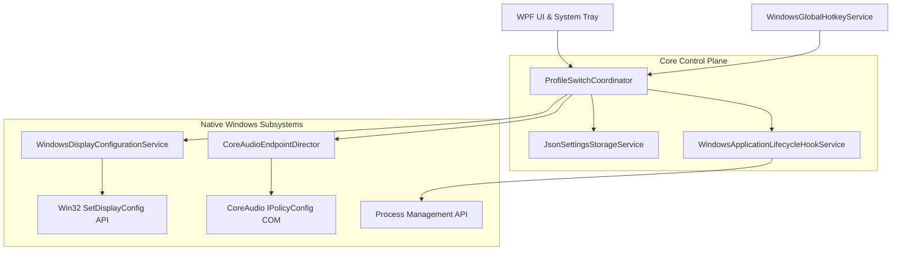
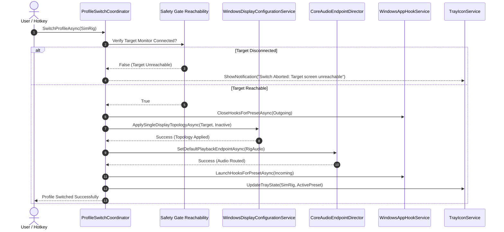

# System Architecture & Technical Specifications

RigSwitch is engineered strictly according to Steven T. Pelech's **`AgenticEngineeringToolbelt`** specifications for native Windows desktop software.

---

## High-Level Component Topology

The following diagram illustrates the interaction between the user interface, hardware coordinator, and native Windows subsystems:

---

## Switching Sequence Flow

The atomic switching process follows a rigorous safety-gated execution sequence:

---

## Architectural Principles & Disciplines

1. **Anti-Bloat Discipline**: Strictly zero `*Manager`, `*Helper`, or `*Util` catch-all classes. Subsystems are bounded to single responsibilities with explicit contracts (`IDisplayConfigurationService`, `IAudioEndpointDirector`, `ISettingsStorageService`).
2. **File Size Strict Limit**: All source files remain strictly `< 500` lines of code.
3. **Atomic Settings Persistence**: Settings are written to a temporary swap file and committed atomically via atomic file replace to prevent file corruption during sudden system shutdowns.
4. **Thread-Safe Coordination**: `ProfileSwitchCoordinator` synchronizes all switching requests through a `SemaphoreSlim(1, 1)` gate to prevent race conditions from rapid hotkey spamming.
