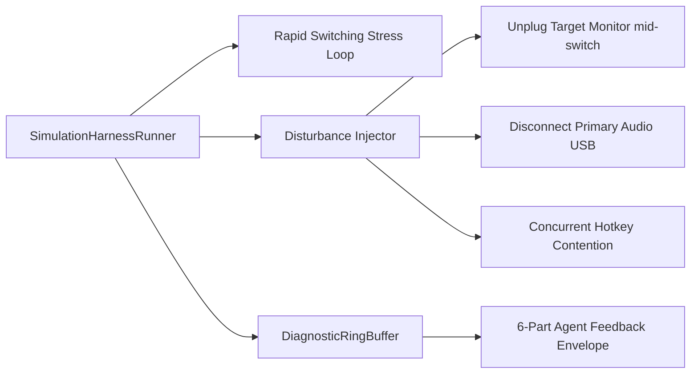

# Simulation Test Harness & Disturbance Injection

RigSwitch includes an industrial-grade simulation test harness (`RigSwitch.Tests.Harness`) following Steven T. Pelech's controls-grade testing patterns.

---

## Architecture of the Test Harness

Rather than testing only superficial happy paths, the simulation harness stress-tests the control plane under real-world hardware turbulence:



---

## Disturbance Scenarios

1. **Unplugged Display Disturbance**: Injects a sudden GPU disconnect event during an active profile switch. Verifies that the reachability safety gate halts execution and prevents tearing down the current active display.
2. **Audio Endpoint Failover Disturbance**: Disconnects the primary USB speaker (e.g. Pebble V3). Verifies that CoreAudio fallbacks to the secondary line-out endpoint without dropping the session.
3. **50-Switch Rapid Stress Loop**: Executes rapid-fire alternating switch requests between Desk and Sim Rig profiles. Verifies zero deadlock, zero thread pool starvation, and clean convergence to the final profile.

---

## 6-Part Agent Feedback Envelope

When any failure or anomaly occurs during harness execution, the diagnostics engine formats a structured JSON diagnostic envelope for root-cause analysis:

```json
{
  "incidentId": "rigswitch-harness-failure-1789",
  "anomaly": "HardwareStateMismatch",
  "expectedState": { "activeDisplay": "MSI4DD0", "defaultAudio": "{0.0.0.00000000}.{D2B56B79}" },
  "actualState": { "activeDisplay": "AUS3438", "defaultAudio": "{0.0.0.00000000}.{A452C881}" },
  "telemetryRingBuffer": [ ... ],
  "suggestedRemediation": "Verify CCD path persistence and retry atomic SetDisplayConfig."
}
```

The test harness guarantees that edge cases and hardware dropouts are caught before any code reaches production.
